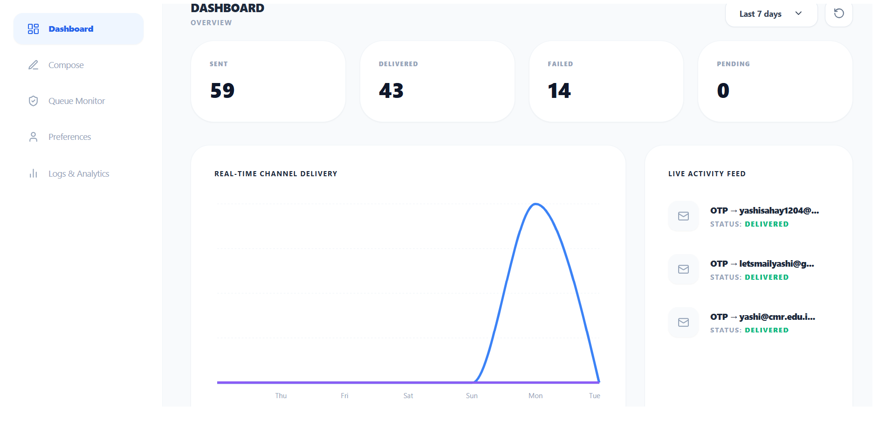
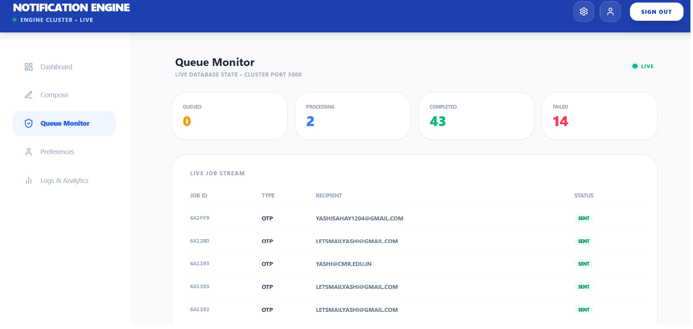
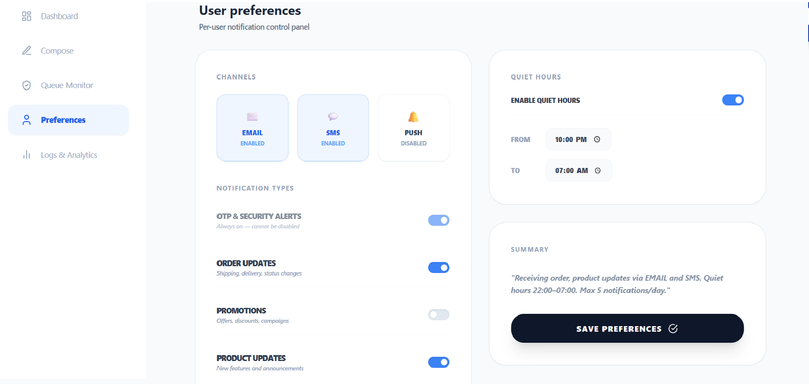
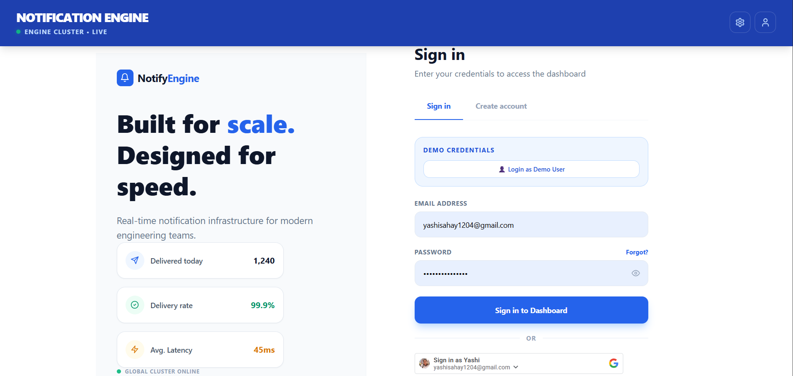

# 🚀 Notification Engine
A full-stack notification infrastructure built with the MERN stack — featuring async job processing with Bull and Redis, JWT + Google OAuth authentication, and a real-time analytics dashboard.
> Built to practice scalable backend architecture, async queue processing, and real-time dashboard UI.
🔗 **Live Demo:** [notification-engine-alpha.vercel.app](https://notification-engine-alpha.vercel.app)
---
## 🌐 Features
- 📧 **Email notifications & OTP** — Transactional emails via Nodemailer + Gmail SMTP
- 🔐 **Auth system** — JWT login/register + Google OAuth 2.0
- ⚙️ **Bull Queue + Redis** — Async job processing with retry logic (3 attempts, 5s backoff) and priority levels
- 📊 **Live Dashboard** — Real-time stats pulled from MongoDB
- 🔍 **Logs & Analytics** — Filter notifications by status and type
- 📬 **Queue Monitor** — Live job stream, polling every 5 seconds
- ⚡ **Rate Limiting** — 100 requests per 15 minutes per IP
- 🌙 **Quiet Hours** — Per-user notification preferences
> SMS/Push channels are scaffolded in the architecture but not yet wired to a provider (Twilio/FCM) — on the roadmap below.
---
## 🛠️ Tech Stack
| Layer | Technology |
|---|---|
| Frontend | React 18, Tailwind CSS, Recharts |
| Backend | Node.js, Express.js |
| Database | MongoDB, Mongoose |
| Queue | Bull, Redis |
| Auth | JWT, bcryptjs, Google OAuth 2.0 |
| Email | Nodemailer + Gmail SMTP |
---
## 📸 Screenshots

### Dashboard


### Queue Monitor


### Preferences


### Login

---

## ⚙️ Setup
### 1. Clone the repo
```bash
git clone https://github.com/Yashi1204/Notification-Engine.git
cd Notification-Engine
```
### 2. Backend
```bash
cd backend && npm install
cp .env.example .env
node server.js
```
### 3. Frontend
```bash
cd frontend && npm install && npm run dev
```
### 4. Redis
```bash
redis-server
```
---
## 📡 API Endpoints
| Method | Endpoint | Description | Auth |
|---|---|---|---|
| POST | `/api/auth/register` | Register new user | ❌ |
| POST | `/api/auth/login` | Login with JWT | ❌ |
| POST | `/api/auth/google` | Google OAuth login | ❌ |
| POST | `/api/notifications/send` | Send notification | ✅ |
| GET | `/api/notifications` | Get all notifications | ❌ |
---
## 🔑 Key Technical Highlights
**Async Job Queue (Bull + Redis)**
Notifications aren't sent synchronously — every request adds a job to a Bull queue backed by Redis, with 3 retry attempts, 5-second backoff delay, and priority levels.
**JWT + Google OAuth**
Passwords hashed with bcryptjs. JWT tokens expire in 7 days. Google OAuth verifies ID tokens server-side using `google-auth-library`.
**Real-time Dashboard**
Dashboard stats and charts fetch live from MongoDB. Queue monitor polls every 5 seconds for live job status.
---
## 🗺️ Roadmap
- [ ] SMS notifications via Twilio
- [ ] Push notifications via Firebase Cloud Messaging
- [ ] WebSocket-based live updates (replace polling)
---
## 🧠 What I Learned
- Designing decoupled architecture where the API and queue processing are separate concerns
- Implementing async job queues with Bull and Redis for reliable delivery
- Building real-time UI that syncs with live backend data
- Handling OAuth flows securely on both client and server
- Managing environment secrets and Git hygiene in a production-style project
---
## 👩‍💻 Author
**Yashi**
[GitHub](https://github.com/Yashi1204) • [LinkedIn](https://www.linkedin.com/in/yashi1204)
---
## 📄 License
MIT
